---
# try also 'default' to start simple
theme: purplin
# apply any windi css classes to the current slide
class: 'text-center'
# https://sli.dev/custom/highlighters.html
highlighter: shiki
# show line numbers in code blocks
lineNumbers: false
# some information about the slides, markdown enabled
info: |
  ## Applying Functional Principles in Vue
# persist drawings in exports and build
drawings:
  persist: false
---

## Applying Functional Principles

<div class="py-20 relative w-25 h-25 m-auto">
  
  <div class="relative z-10 text-5xl italic w-25 h-25 rounded-full border border-white border-2 m-auto flex items-center justify-center text-green-700">λ</div>
</div>

---

<div grid="~ cols-3 gap-2 ">


<div class="col-span-2 text-center flex flex-col justify-between">

# Lindsay Wardell

<v-clicks>

<div>

#### Software Engineer


</div>

</v-clicks>

<div class="flex justify-around w-2/3 mx-auto">

<v-clicks>

<div class="flex-1 flex justify-center"></div>

<div class="flex-1 flex justify-center"></div>

<div class="flex-1 flex justify-center"></div>

</v-clicks>

</div>

<v-clicks>

https://www.noredink.com/jobs

</v-clicks>

</div>

</div>

<div class="abs-bl m-6 text-xl !border-none text-right">
  <div class="flex">
    <carbon-logo-twitter class="w-16" />  <span>lindsaykwardell</span>
  </div>
  <div class="flex">
    <carbon-logo-github class="w-16" /> <span> lindsaykwardell</span>
  </div>
  <div class="flex underline">
    <div class="w-16" /> lindsaykwardell.com
  </div>
</div>

---
layout: center
---

# What is Functional Programming?

---

<div class="flex gap-4">
<div class="flex-1">

```vue {all|4-9|10|12-18|21-27}
<script setup>
  import { ref } from 'vue'

  const props = defineProps({
    initialCount: {
      type: Number,
      default: 0
    }
  })
  const count = ref(props.initialCount)

  function increment() {
    count.value++
  }

  function decrement() {
    count.value--
  }
</script>

<template>
  <div>
    <button @click="decrement">-</button>
    <div>{{ count }}</div>
    <button @click="increment">+</button>
  </div>
</template>
```

</div>
<div class="flex-1">

## What is Vue?

Vue is a JavaScript framework for building user interfaces.

It builds on top of standard HTML, CSS and JavaScript, and provides a declarative and component-based programming model that helps you efficiently develop user interfaces, be it simple or complex.

</div>

</div>

---

<div class="flex gap-4">
<div class="flex-1">

## What is Functional Programming?

Building an application by composing functions together.

- Same inputs = same outputs
- Reduce side effects
- Reduce mutation

Organize code around data structures and functions

<div class="flex space-between w-full">

<div class="flex-1"></div>

<div class="flex-1"></div>

<div class="flex-1"></div>

<div class="flex-1"></div>

<div class="flex-1"></div>

</div>

</div>
<div class="flex-1">


</div>

</div>

---

<div class="flex gap-4">
<div class="flex-1">

## What is Functional Programming?

Building an application by composing functions together.

- Same inputs = same outputs
- Reduce side effects
- Reduce mutation

Organize code around data structures and functions

<div class="flex space-between w-full">

<div class="flex-1"></div>

<div class="flex-1"></div>

<div class="flex-1"></div>

<div class="flex-1"></div>

<div class="flex-1"></div>

</div>

</div>
<div class="flex-1">

```elm {all|1|3-7|9-18|20-26}
type alias Model = Int

type alias Flags = Int

init : Flags -> Model
init flags =
    flags

type Msg = Increment | Decrement

update : Msg -> Model -> Model
update msg model =
  case msg of
    Increment ->
      model + 1

    Decrement ->
      model - 1

view : Model -> Html Msg
view model =
  div []
    [ button [ onClick Decrement ] [ text "-" ]
    , div [] [ text (String.fromInt model) ]
    , button [ onClick Increment ] [ text "+" ]
    ]
```

</div>

</div>

---

<div class="flex gap-4">
<div class="flex-1">

```vue
<script setup>
  import { ref } from 'vue'

  const props = defineProps({
    initialCount: {
      type: Number,
      default: 0
    }
  })
  const count = ref(props.initialCount)

  function increment() {
    count.value++
  }

  function decrement() {
    count.value--
  }
</script>

<template>
  <div>
    <button @click="decrement">-</button>
    <div>{{ count }}</div>
    <button @click="increment">+</button>
  </div>
</template>
```

</div>
<div class="flex-1">

```elm 
type alias Model = Int

type alias Flags = Int

init : Flags -> Model
init flags =
    flags

type Msg = Increment | Decrement

update : Msg -> Model -> Model
update msg model =
  case msg of
    Increment ->
      model + 1

    Decrement ->
      model - 1

view : Model -> Html Msg
view model =
  div []
    [ button [ onClick Decrement ] [ text "-" ]
    , div [] [ text (String.fromInt model) ]
    , button [ onClick Increment ] [ text "+" ]
    ]
```

</div>

</div>

---
layout: center
---

# Functional Vue?

---

### Test Type

```ts
export type Test = {
  id: number;
  description: string;
  status: TestStatus;
  results: boolean[];
};

export type TestStatus = "IDLE" | "RUNNING" | "SUCCESS" | "FAILURE";
```

### Pinia Store

```ts
interface TestStore {
  tests: Test[]
  getTests: Test[]
  nextTestId: number
  testRunnerStatus: "IDLE" | "RUNNING" | "FINISHED"
  initializeTests: () => Promise<void>
  addTest: (description: string) => void
  updateTest: (input: Test) => void
  storeResult: (testId: number, result: boolean) => void
  runTests: () => void
}
```

---

# Same inputs = same outputs

```ts {all|2-6}
import { computed } from "vue";
import { useTestStore } from "@/stores/tests";

const store = useTestStore();
const testRunnerStatus = computed(() => store.testRunnerStatus);
const getTests = computed(() => store.getTests);

async function initTests(): Promise<void> {
  if (testRunnerStatus.value === "RUNNING") return;

  store.runTests();
}
```

---

# Same inputs = same outputs

```ts {all|2-7|9-22}
import { computed } from "vue";
import type { Test } from "@/stores/tests";

const props = defineProps<{
  testRunnerStatus: "IDLE" | "RUNNING" | "FINISHED";
  tests: Test[];
}>();

const testButtonClass = computed(() => {
  if (props.testRunnerStatus === "RUNNING")
    return "bg-green-300 cursor-not-allowed";
  else return "bg-green-500 hover:bg-green-400";
});
const totalRunningTests = computed(
  () => props.tests.filter((test) => test.status === "RUNNING").length
);
const totalPassedTests = computed(
  () => props.tests.filter((test) => test.status === "SUCCESS").length
);
const totalFailedTests = computed(
  () => props.tests.filter((test) => test.status === "FAILURE").length
);
```

---

# Same inputs = same outputs

<v-clicks>

```ts
const props = defineProps<{
  isIdle: boolean;
  isRunning: boolean;
  isFinished: boolean;
  tests: Test[];
}>();
```

```ts
const props = defineProps<{
  testRunnerStatus: string;
  tests: Test[];
}>();
```

</v-clicks>

---

# Same inputs = same outputs

<div class="flex justify-center items-center h-96">

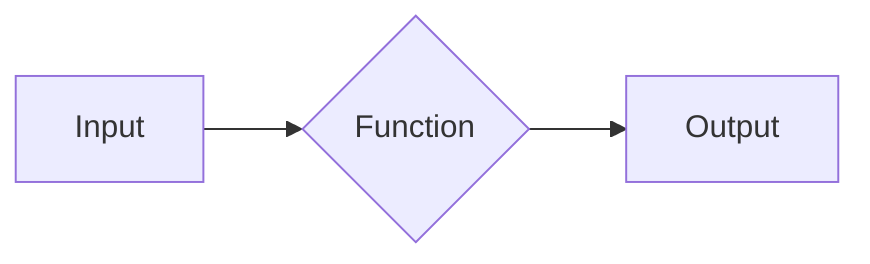

</div>

---

# Same inputs = same outputs

<div class="flex justify-center items-center h-96">

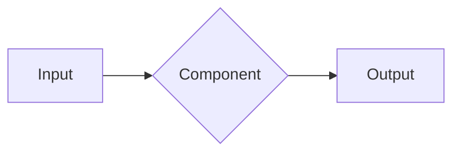

</div>

---

# Same inputs = same outputs

<div class="flex justify-center items-center h-96">

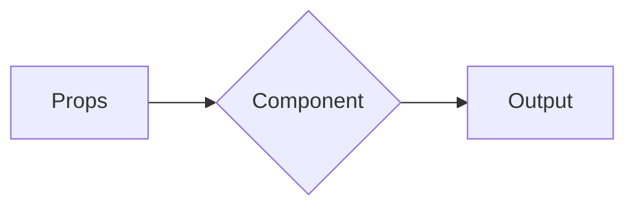

</div>

---

# Same inputs = same outputs

<div class="flex justify-center items-center h-96">

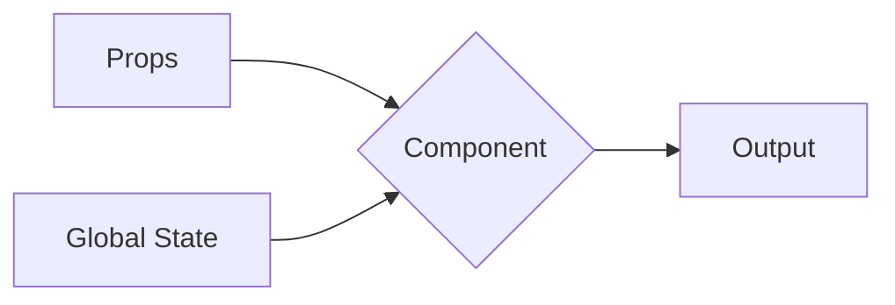

</div>

---

# Same inputs = same outputs

<div class="flex justify-center items-center h-96">

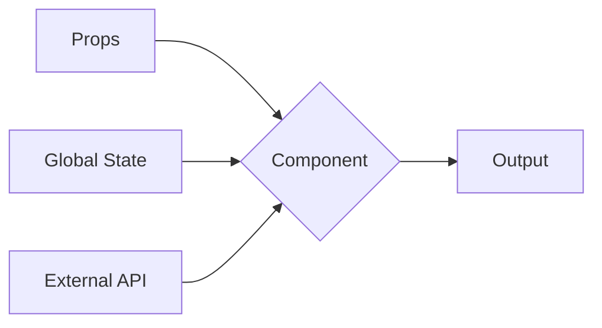

</div>

---

# Same inputs = same outputs

<div class="flex justify-center items-center h-96">

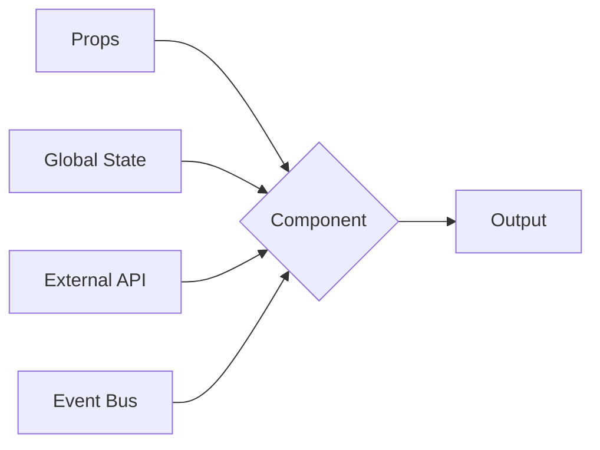

</div>

---

# Same inputs = same outputs

<div class="flex justify-center items-center h-96">

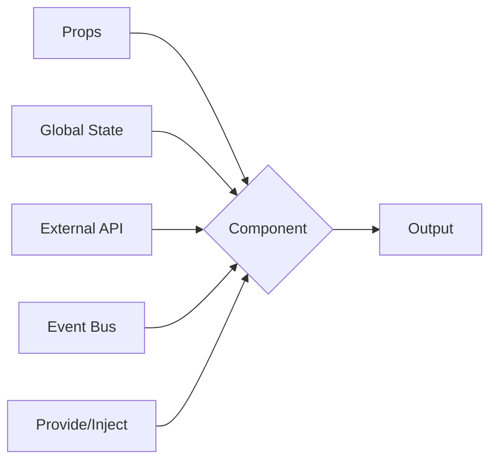

</div>

---

# Same inputs = same outputs

<div class="flex justify-center items-center h-96">

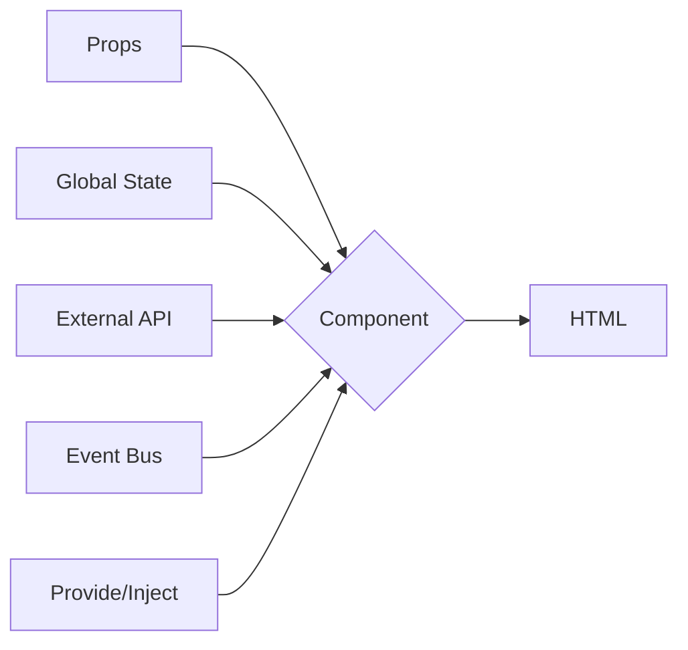

</div>

---

# Same inputs = same outputs

<div class="flex justify-center items-center h-96">

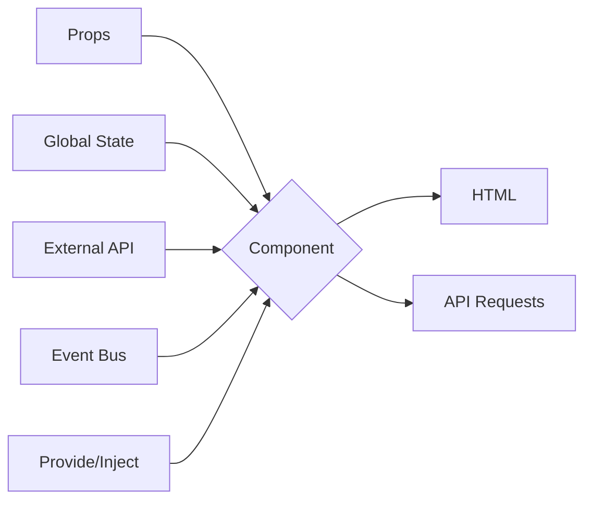

</div>

---

# Same inputs = same outputs

<div class="flex justify-center items-center h-96">

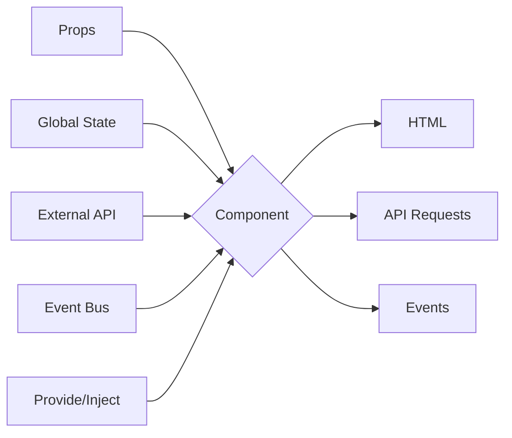

</div>

---

# Same inputs = same outputs

<div class="flex justify-center items-center h-96">

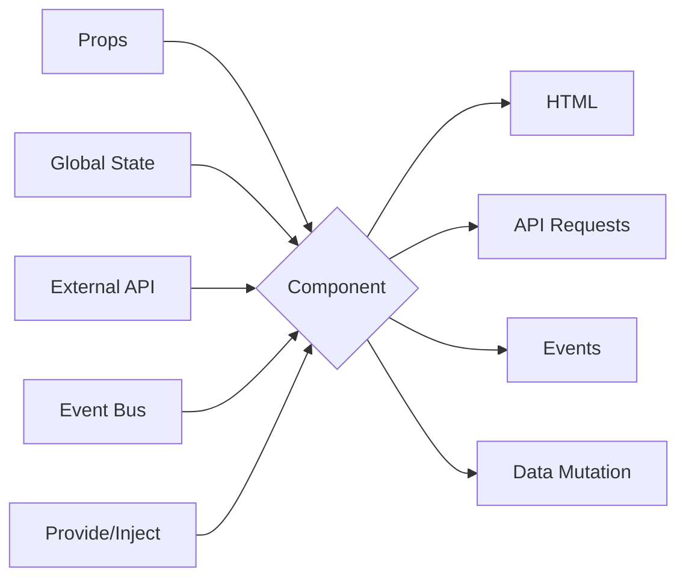

</div>

---

# Same inputs = same outputs

<div class="flex justify-center items-center h-96">

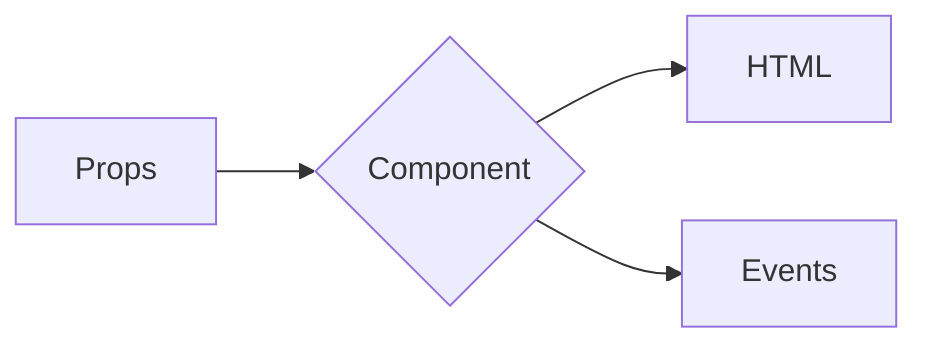

</div>

---

# Reduce Side Effects

<div class="flex gap-4">

<div class="flex-1">

## What are Side Effects?

<v-clicks>

- Calling an external API
- Interacting with the DOM
- Mutating arguments/outside values
- Performing an action automatically
- Generating something beyond the function scope

</v-clicks>

</div>

<div class="flex-1">

</div>

</div>

---

# Reduce Side Effects

<div class="flex gap-4">

<div class="flex-1">

## What are Side Effects?

- Calling an external API
- Interacting with the DOM
- Mutating arguments/outside values
- Performing an action automatically
- Generating something beyond the function scope

</div>

<div class="flex-1">

```html {all|5-6,16,20|8-10}
<script setup lang="ts">
import { ref } from 'vue';
import api from 'useApi'; // Mocked API for example

const username = ref("");
const password = ref("");

function login() {
  api.login(username.value, password.value).then(res => {...});
}
</script>
<template>
  <form @submit.prevent="login">
    <label>
      Username
      <input v-model="username">
    </label>
    <label>
      Password
      <input type="password" v-model="password">
    </label>
    <button>Log in</button>
  </form>
</template>
```

</div>

</div>

---

# Reduce Side Effects

<div class="flex gap-4">

<div class="flex-1">

## What are Side Effects?

- Calling an external API
- Interacting with the DOM
- Mutating arguments/outside values
- Performing an action automatically
- Generating something beyond the function scope

</div>

<div class="flex-1">

```ts {all|3-9|11-19|4-5,13,16}
import { computed, reactive } from 'vue'

const state = reactive({
  firstName: '',
  lastName: '',
  email: '',
  password: '',
  confirmPassword: ''
})

const fullName = computed(() => {
  if (typeof state.firstName !== 'string') {
    state.firstName = ''
  }
  if (typeof state.lastName !== 'string') {
    state.lastName = ''
  }
  return `${state.firstName} ${state.lastName}`
})
```

</div>

</div>

---

# Reduce Side Effects

<div class="flex gap-4">

<div class="flex-1">

## What are Side Effects?

- Calling an external API
- Interacting with the DOM
- Mutating arguments/outside values
- Performing an action automatically
- Generating something beyond the function scope

</div>

<div class="flex-1">

```ts {all|9-11|13-17}
import { computed, ref, watch } from "vue";
import { useTestStore } from "@/stores/tests";

const store = useTestStore();
const getTests = computed(() => store.getTests);

const description = ref("");

function addTestHandler(): void {
  store.addTest(description.value);
}

watch(getTests.value, (newVal, prevVal) => {
  if (newVal.length !== prevVal.length) {
    description.value = "";
  }
});
```

</div>

</div>

---

# Reduce Side Effects

<div class="flex gap-4">

<div class="flex-1">

## What are Side Effects?

- Calling an external API
- Interacting with the DOM
- Mutating arguments/outside values
- Performing an action automatically
- Generating something beyond the function scope

</div>

<div class="flex-1">

```ts {all|10}
import { computed, ref } from "vue";
import { useTestStore } from "@/stores/tests";

const store = useTestStore();
const getTests = computed(() => store.getTests);

const description = ref("");

function addTestHandler(): void {
  store.addTest(description.value);

  description.value = '';
}
```

</div>

</div>

---

# Reduce Side Effects

<div class="flex gap-4">

<div class="flex-1">

## What are Side Effects?

- Calling an external API
- Interacting with the DOM
- Mutating arguments/outside values
- Performing an action automatically
- Generating something beyond the function scope

</div>

<div class="flex-1">

```ts
import { computed, ref } from "vue";
import { useTestStore } from "@/stores/tests";

const store = useTestStore();
const getTests = computed(() => store.getTests);

const description = ref("");

function addTestHandler(): void {
  store.addTest(description.value);

  description.value = '';
}
```

```ts
function addTest(description: string) {
  this.tests = [
    ...this.tests,
    { description, 
      id: this.nextTestId,
      status: "IDLE",
      results: [] 
    },
  ];
}
```

</div>

</div>

---
layout: center
---

# Reduce Mutation

---

# Reduce Mutation

```ts {all|9-20|10|12-17}
import { computed, ref } from "vue";
import { useTestStore } from "@/stores/tests";

const store = useTestStore();
// const getTests = computed(() => store.getTests);

const description = ref("");

function addTestHandler(): void {
  // store.addTest(description.value);

  store.tests.push({
    id: store.nextTestId,
    description: description.value,
    status: "IDLE",
    results: [],
  });

  description.value = "";
}
```

---

# Reduce Mutation

<div class="flex gap-4">
<div class="flex-1">

```ts
function getTests(state) {
  return readonly(
    [...state.tests].sort((a, b) => {
      if (a.status === b.status) return 0;

      if (a.status === "RUNNING") return -1;
      if (b.status === "RUNNING") return 1;

      if (a.status === "SUCCESS") return -1;
      if (b.status === "SUCCESS") return 1;

      if (a.status === "FAILURE") return -1;
      if (b.status === "FAILURE") return 1;

      return 0;
    })
  )
}
```

</div>

<div class="flex-1">

> ## readonly


> Takes an object (reactive or plain) or a ref and returns a readonly proxy to the original.


> A readonly proxy is deep: any nested property accessed will be readonly as well. It also has the same ref-unwrapping behavior as reactive(), except the unwrapped values will also be made readonly.


</div>

</div>

---

# Reduce Mutation

<div></div>

<v-clicks>


</v-clicks>

---
layout: center
---

# Functional Vue?

<div class="flex justify-center">

<v-clicks>

## Yes!

</v-clicks>

</div>

---

# Functional Vue

<v-clicks>

## Same inputs = same outputs

- More testable components
- Strong, defined internal APIs

## Reduce Side Effects

- Reduce scope of components
- Centralize API calls
- Isolate dangerous interactions

## Reduce Mutation

- More predictable applications
- Simplified state management

</v-clicks>

---
layout: center
class: text-center
---

# elm-vue-bridge


## Render Elm modules in a Vue app

https://elm-vue-bridge.lindsaykwardell.com/

---

```vue
<script setup>
import elmBridge from 'elm-vue-bridge';
import { Elm } from './Main.elm';

const Counter = elmBridge(Elm, {
  name: "Counter",
  emit: ["sendCount"],
  props: {
    initialValue: {
      type: Number,
      default: 2,
    },
  },
});

const value = ref(3);

function sendCount(val: number) {
  value.value = val;
  console.log(val);
}
</script>

<template>
  <Counter :initialValue="value" @sendCount="sendCount" />
</template>
```

---

<div grid="~ cols-3 gap-2 ">


<div class="col-span-2 text-center flex flex-col justify-between">

# Lindsay Wardell

<div>

#### Software Engineer


</div>

<div class="flex justify-around w-2/3 mx-auto">

</div>

https://www.noredink.com/jobs

</div>

</div>

<div class="abs-bl m-6 text-xl !border-none text-right">
  <div class="flex">
    <carbon-logo-twitter class="w-16" />  <span>lindsaykwardell</span>
  </div>
  <div class="flex">
    <carbon-logo-github class="w-16" /> <span> lindsaykwardell</span>
  </div>
  <div class="flex underline">
    <div class="w-16" /> lindsaykwardell.com
  </div>
</div>